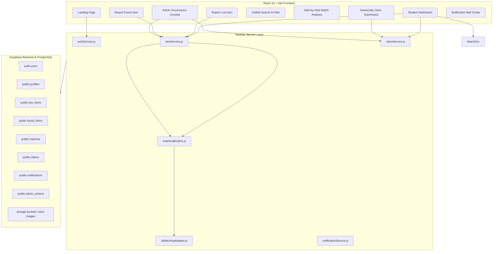

# CampusFind AI — Smart Campus Lost & Found Platform

> **Find What Was Lost. Return What Was Found.**  
> An intelligent, centralized lost-and-found management platform built for university campuses, powered by multi-attribute confidence scoring, verified claim workflows, and transparent security administration.

---

## 📌 Problem Statement

Traditional university lost-and-found systems suffer from critical inefficiencies:
- **Fragmented Channels**: Reports are scattered across unofficial social media groups, physical departmental desks, and email threads.
- **Manual Overhead**: Campus security officers manually compare paper logs, resulting in low recovery rates.
- **Fraudulent Claims**: Unverified claims often result in wrongful handoffs of high-value items (laptops, wallets, AirPods).
- **Delayed Notifications**: Owners frequently discover items days after they were turned in, leading to cluttered storage.

---

## 💡 Solution & Key Features

CampusFind AI centralizes campus property recovery into a secure, structured web platform:

### 1. 🔍 Dual Incident Reporting
- **Report Lost Items**: Capture title, category, subcategory, detailed description, color, campus location, date/time, and photo uploads.
- **Report Found Property**: Turn-in logging with designated custody location tracking (e.g. *Turned in at Library Front Desk*).

### 2. ⚡ Modular Weighted Matching Engine
- Automated matching algorithm calculating multi-factor confidence scores (e.g. `94% Top Match`):
  - **Category Alignment**: 25%
  - **Description & Keyword Similarity (Jaccard NLP)**: 25%
  - **Campus Location Proximity**: 20%
  - **Date / Temporal Proximity**: 15%
  - **Color Matching**: 10%
  - **Visual / Photo Confidence**: 5%
- Transparent **"Why This Match?"** explanation breakdown with side-by-side photo and metadata comparison.

### 3. 🛡️ Verified Claim Workflow
- Claimants must provide confidential proof of ownership (private markings, roll numbers, serial numbers) and optional receipt/ID proof.
- Direct handoff prevents automated fraudulent claims.

### 4. 🔔 Real-Time Notifications
- In-app notification center with unread badges alerting users to match detections, claim approvals, and collection instructions.

### 5. 👮 Administrative Governance Console
- Moderator dashboard with 6 platform metrics (*Users*, *Lost Reports*, *Found Property*, *Active Matches*, *Pending Claims*, *Returned Items*).
- Claim adjudication tool (Approve / Reject with official review notes).
- Immutable audit action trail (`admin_actions`) logging every moderation decision.

---

## 🛠️ Technology Stack

| Layer | Technology |
| :--- | :--- |
| **Frontend** | React 18, Vite 6, Tailwind CSS, Lucide Icons, React Router 7 |
| **Backend / Database** | Supabase PostgreSQL, Row Level Security (RLS) |
| **Authentication** | Supabase Auth (Session Persistence, Profile Triggers, Role Enforcement) |
| **Storage** | Supabase Storage (`item-images` bucket with 5MB validation) |
| **Design System** | Dark mode glassmorphism palette, Inter & Outfit typography |
| **Deployment** | Vercel |

---

## 🏗️ System Architecture



---

## 🗄️ Database Schema & Security

The PostgreSQL database enforces strict **Row Level Security (RLS)** across all 7 tables:

1. `profiles`: `id` (PK, references `auth.users`), `full_name`, `email`, `college_id`, `phone`, `avatar_url`, `role` (`student` | `admin`).
2. `lost_items`: `id`, `user_id`, `title`, `description`, `category`, `subcategory`, `color`, `location`, `lost_date`, `lost_time`, `image_url`, `status` (`active`, `matched`, `claimed`, `returned`, `closed`).
3. `found_items`: `id`, `user_id`, `title`, `description`, `category`, `subcategory`, `color`, `location`, `found_date`, `found_time`, `image_url`, `status`.
4. `matches`: `id`, `lost_item_id`, `found_item_id`, `match_score`, `category_score`, `description_score`, `location_score`, `date_score`, `color_score`, `image_score`, `match_reason`, `status`.
5. `claims`: `id`, `match_id`, `claimant_id`, `proof_message`, `proof_image_url`, `status` (`pending`, `approved`, `rejected`), `admin_note`, `reviewed_by`, `reviewed_at`.
6. `notifications`: `id`, `user_id`, `title`, `message`, `type`, `reference_id`, `is_read`, `created_at`.
7. `admin_actions`: `id`, `admin_id`, `action`, `target_type`, `target_id`, `description`, `created_at`.

---

## 🚀 Getting Started Locally

### 1. Prerequisites
- **Node.js**: v18.0+ (Tested on v24.19 LTS)
- **npm**: v9.0+

### 2. Clone and Install Dependencies
```bash
git clone https://github.com/texhX/techX-21.git
cd techX-21
npm install
```

### 3. Environment Configuration
Create `.env.local` in the project root:
```env
VITE_SUPABASE_URL=https://your-project.supabase.co
VITE_SUPABASE_PUBLISHABLE_KEY=your-supabase-anon-key

# Optional: External AI Adapter Configuration
VITE_AI_PROVIDER=baseline
VITE_AI_API_KEY=
```

### 4. Database Setup
1. Open your Supabase Dashboard -> **SQL Editor**.
2. Copy the contents of `supabase/schema.sql` and click **Run**.
3. Storage bucket `item-images` and RLS policies are created automatically.

### 5. Run Development Server
```bash
npm run dev
```
Open `http://localhost:5173` in your browser.

---

## 🎭 11-Step Hackathon Demonstration Flow

To evaluate the platform during live presentations:

1. **Student Login**: Click **Log In** -> Select **Student Demo** (*Alex Johnson*).
2. **Report Lost Item**: Navigate to `/report-lost` -> Submit *Black Leather Bifold Wallet* lost yesterday at Central Campus Library with photo.
3. **Found Property Turn-In**: Another student or staff reports *Black Leather Wallet with Student ID* found at Library Desk.
4. **Automated Matching**: Engine calculates a **94% Confidence Match**.
5. **Instant Notification**: Student receives high-priority alert in the notification center.
6. **Side-by-Side Analysis**: Student reviews the dual-column comparison modal with factor breakdown bars.
7. **Submit Claim**: Student submits identifying details (*"Student ID CS-2024-042 and blue transit card inside"*).
8. **Admin Review**: Sign out -> Log in via **Admin Demo** (*Campus Security Admin*).
9. **Claim Approval**: Review proof in the **Claims Review** tab and click **Confirm Approval** with review note.
10. **Pickup Notification**: Student receives collection instructions (*Campus Security Main Desk*).
11. **Item Returned**: Item state transitions to **Returned** and action is recorded in the **Audit Action Log**.

---

## 🌿 Git Feature-Branch Workflow

```bash
# Create feature branch
git checkout main
git pull origin main
git checkout -b feature/<feature-name>

# Stage and commit changes
git add .
git commit -m "Add descriptive commit message"

# Push to GitHub
git push -u origin feature/<feature-name>
```

---

## 📦 Deployment (Vercel)

1. Connect the repository to [Vercel](https://vercel.com).
2. Add Environment Variables in project settings:
   - `VITE_SUPABASE_URL`
   - `VITE_SUPABASE_PUBLISHABLE_KEY`
3. Deploy! (Single Page Application routing handled automatically via Vite).

---

## 👥 Hackathon Team & Credits

- **Event**: TechXplore 2026 Hackathon
- **Team**: TechX-21
- **License**: MIT License
